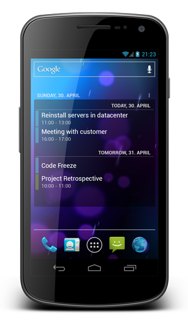

# Android Calendar Widget

The Android calendar widget is home screen widget for your Android device. It displays a list of upcoming calendar events so that you can easily have a glimpse at your upcoming appointments.

Want to contribute to the project? Start by translating the widget to another language. Visit the [project at crowdin.net](http://crowdin.net/project/plusonelabs-calendar-widget) and be part of the next release. :)

## Features

* Displays all events from your calendars. Optionally shows past events.
* Automatically updates when you add/delete/modify an event. Or you may update the list instantly.
* Select only the calendars you want to see in the widget.
* Create several widgets, if you need. Each widget will have its own settings, including filters 
and selected calendars.
* Customize colors of the widget background and texts.
* Scroll through the list of upcoming events.
* Customize the text size of the widget.
* Fully resizable widget with two alternative layouts.
* Indicators for alerts and recurring events.
* Lock time zone when travelling to different time zones.
* Turn off Day headers and see dates in the "Days from today" column.
* Android 4 to 7 supported. Supports Android tablets.

## Collaborate

We are developing this application in public to bring you a tool that _you_ want to use. Please feel free to open [issues](https://github.com/plusonelabs/calendar-widget/issues) and provide [pull requests](https://github.com/plusonelabs/calendar-widget/pulls). To get timely feedback we are also making use of the open beta feature in the Google Play Store. Please [opt-in here](https://play.google.com/apps/testing/com.plusonelabs.calendar).

We are also looking for new and improved translations over at http://crowdin.net/project/plusonelabs-calendar-widget.

## Changelog

### [v1.10.1](https://github.com/plusonelabs/calendar-widget/issues?q=milestone%3A1.10.1)

* Fix issue where widget would crash because of unexpected widgetId
* Translations updates

### [v1.10.0](https://github.com/plusonelabs/calendar-widget/issues?q=milestone%3A1.10.0)

* Added: Different settings for different Widget instances allow you to create any number of
customized views of your events, including configuration of different calendars for different widgets.
All setting are separate for each Widget instance. In order not to get confused in 
configurations of different widgets, you can launch "Calendar Widget" with your Android Launcher 
and you will be presented with a widget selection list. Each widget can be given its name 
to ease configuring. See [screenshots](https://github.com/plusonelabs/calendar-widget/issues/37#issuecomment-290968481). 
* Added: "Show day headers" option to disable day headers completely.
* Added: The alternative widget layout: "All in one row". Each event can now occupy literally one line 
only. "Appearance -> Event entry layout" option allows 
to switch between the "Time below title" layout and this new one. When used with the
"Show day headers" option, this layout almost doubles number of events visible in a widget without scrolling.
"Days from Today" column replaces day headers in a case the Day Headers are 
turned off. See [screenshots](https://github.com/plusonelabs/calendar-widget/issues/42#issuecomment-289261236).
* Added: "Abbreviate dates" option allows to have shorter date format for both Widget and Day headers.
* Added: "Lock time zone" option to show events in the same Time Zone when travelling to different time zones.
* Added: "Show only the closest instance of a recurring event". You can set 
"Event Filters"->"Date range" to "One year", and your agenda won't be an endless list of the same events.
* Improved: Use space or commas in "Hide based on keywords in a title". Place a text in single or
double quotes in order to have space or comma in a filter.
* Android 7 compatibility, including support of permissions introduced in Android 6.

### [v1.9.3](https://github.com/plusonelabs/calendar-widget/issues?q=is%3Aissue+milestone%3A1.9.3)

* Date format "auto" now makes use of system wide date settings
* Bugfixes for the 1.9 release
* Translation updates

### [v1.9.2](https://github.com/plusonelabs/calendar-widget/issues?q=is%3Aissue+milestone%3A1.9.2)

* Bugfixes for the 1.9 release
* Translation updates

### [v1.9.1](https://github.com/plusonelabs/calendar-widget/issues?q=is%3Aissue+milestone%3A1.9.1)

* Bugfixes for 1.9 release

### [v1.9.0](https://github.com/plusonelabs/calendar-widget/issues?q=is%3Aissue+milestone%3A1.9)

* New preferences to filter the events shown by the widget
  * New "Show events that ended recently" option allows to show events, which ended several hours ago, today or yesterday. [#122](https://github.com/plusonelabs/calendar-widget/issues/122)
  * New "Show all past events having default color" option shows all past events, which have 'Default color'. This option may be used to treat calendar events as Tasks and mark their completion by changing event's color. [#138](https://github.com/plusonelabs/calendar-widget/issues/138)
  * New "Hide based on keywords in a title" option, which acts on all events. Multiple keywords may be separated by spaces or commas.
* Add "Past events background color" option.
* Add "Today" option to "Date range", so you can see current and future events for today only (The same "Today" option exists for past events also) [#156](https://github.com/plusonelabs/calendar-widget/issues/156)
* Add "Refresh" button to widget header to refresh the list of events [#120](https://github.com/plusonelabs/calendar-widget/issues/120)
* Add "Show days without events" option

### [v1.8.6](https://github.com/plusonelabs/calendar-widget/issues?q=milestone%3A1.8.6+is%3Aclosed)

* Add styling for Android 5.0 (Lollipop)
* Adding widget to home screen instantly adds it without showing settings ui
* Add launcher entry to more easily access the settings of the widget
* Add support for new languages swedish, ukraine, vietnamese, traditional chinese and finish (thanks to all contributors)

### [v1.8.5](https://github.com/plusonelabs/calendar-widget/issues?milestone=24&state=closed)

* Fixes problem where all day events would be shown one day off

### [v1.8.4](https://github.com/plusonelabs/calendar-widget/issues?milestone=23&state=closed)

* The calendar selection preferences now show the account a calendar comes from (thanks @thknepper)
* Fixes issue where the date shown in the widget and in a calendar app would deviate (thanks @schmaller)
* Adds translation for Portuguese, Romanian and Greek
* Updates several other other translations

### [v1.8.3](https://github.com/plusonelabs/calendar-widget/issues?milestone=22&state=closed)

* Adds Korean translation
* Fixes problem where the Norwegian translation was not visible to users

### [v1.8.2](https://github.com/plusonelabs/calendar-widget/issues?milestone=21&state=closed)

* Updates translations and adds support for simplified Chinese, Bulgarian and Norwegian

### [v1.8.1](https://github.com/plusonelabs/calendar-widget/issues?milestone=20&state=closed)

* Fixes issue where the date headers for "Today" and "Tomorrow" where not show correctly
* Updates translations and adds partial support for Hebrew (thanks bomba6)

### [v1.8](https://github.com/plusonelabs/calendar-widget/issues?milestone=19&state=closed)

* Adds option to align the date header left, right and center
* Allows to show events spreading over multiple days only on the first day
* Enables to show only events in a one day date range (thanks jganetsk)
* Adds new translations in Dutch and polish
* A big thanks to at all the people who have helped with translations on crowdin.net
 * blancazert, deamn, emes2, gabrielemariotti, hermajan, jagoda1-72, k.schasfoort, moritzpost

### [v1.7.2](https://github.com/plusonelabs/calendar-widget/issues?milestone=18&state=closed)

* Fine tunes the shading of the text colors
* Fixes tinting issue of background color

### [v1.7.1](https://github.com/plusonelabs/calendar-widget/issues?milestone=17&state=closed)

* Fixes critical bug on Android 4.0 devices
* Completes Czech translation (thanks hermajan)

### [v1.7](https://github.com/plusonelabs/calendar-widget/issues?milestone=16&state=closed)

* Adds theming capabilities to the widget background and texts
* Taping on current date header now opens calendar app
* Calendar events can now show their event specific color

### [v1.6.4](https://github.com/plusonelabs/calendar-widget/issues?milestone=15&state=closed)

* Updates Czech translation
* Fixes critical bug on Android 4.4

### [v1.6.3](https://github.com/plusonelabs/calendar-widget/issues?milestone=14&state=closed)

* Adds support for multiple languages: Spanish, French, Italian and Brazilian Portuguese
* Adds option to hide end date (contributed by ultraq)
* Background transparency is set in 5% increments instead of 10% (contributed by ultraq)
* Fixed bug where events starting or ending at midnight would not show their time correctly

### [v1.6.2](https://github.com/plusonelabs/calendar-widget/issues?milestone=13&state=closed)

* Fixed serious crash when preferences from older installations were present

### [v1.6.1](https://github.com/plusonelabs/calendar-widget/issues?milestone=12&state=closed)

* Fixed a crash of Samsungs S Planner when creating new event

### [v1.6](https://github.com/plusonelabs/calendar-widget/issues?milestone=11&state=closed)

* Added option to show the event location
* Added option to span title over multiple lines
* Added ability to choose from more font sizes
* Added option to set the event date range

### [v1.5.2](https://github.com/plusonelabs/calendar-widget/issues?milestone=10&state=closed)

* Added support for Hungarian and Russian language

### [v1.5.1](https://github.com/plusonelabs/calendar-widget/issues?milestone=9&state=closed)

* Added support for Czech language
* Fixed crashes when adding event on certain devices
* Fixed issue with spanning events

### [v1.5](https://github.com/plusonelabs/calendar-widget/issues?milestone=8&state=closed)

* Enabled support to place the calendar widget on the lock screen
* Calendar events can now be added directly from the widget
* Added Japanese translations (Thanks to Sakuma)
* Fixed several stability issues

### [v1.4](https://github.com/plusonelabs/calendar-widget/issues?milestone=7&state=closed)

* Fixed critical issue where an all-day event would be displayed one day to early in certain timezones
* Added ability to configure the transparency of the widget background

### [v1.3.2](https://github.com/plusonelabs/calendar-widget/issues?milestone=6&state=closed)

* Added support for custom event colors
* Calendar colors are now correctly shown on Jelly Bean
* Fixed issue when opening the calendar selection preference activity
* Fixed problem with events that span multiple days

### [v1.3.1](https://github.com/plusonelabs/calendar-widget/issues?milestone=5&state=closed)

* Fixed problem where noon was display as 0:00 pm instead of 12:00 pm
* Fixed issue when no calendar is present on the device

### [v1.3](https://github.com/plusonelabs/calendar-widget/issues?milestone=4&state=closed)

* Added support for the am/pm date format
* Events that span multiple days now create multiple entries in the widget
* Touching a calendar entry now provides visual touch feedback
* Events without title now indicate that there is no title

### [v1.2.1](https://github.com/plusonelabs/calendar-widget/issues?milestone=3&state=closed)

* Fixed issue where the date in the calendar app would be displayed wrong when opened from the widget

### [v1.2](https://github.com/plusonelabs/calendar-widget/issues?milestone=2&state=closed)

* Added indicators for events with an alert
* Added indicators for recurring events
* Widget refreshes at midnight
* Widget handles time, date, timezone and locale changes correctly

### [v1.1](https://github.com/plusonelabs/calendar-widget/issues?milestone=1&state=closed)

* Added preferences menu
* Added option to select the active calendars for the widget
* An new preferences option allows to hide the current date header to have more space for the calendar entries
* The text size can not be customized as small, medium or large
* The widget can not be shrinked properly on all devices

### v1.0

* Initial Release
