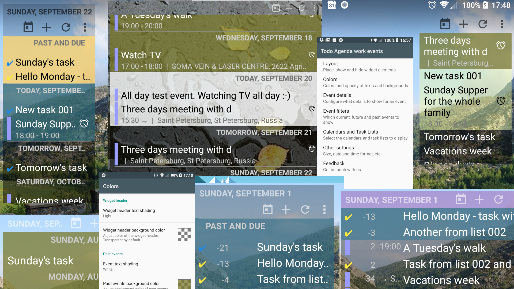

# [Todo Agenda](https://github.com/andstatus/todoagenda#readme) - Calendar and Task widgets for Android

Todo Agenda is home screen widgets for your Android device. 
Each widget has its own settings and displays configured list of calendar events and tasks
so that you can easily have a glimpse at your due, current and upcoming appointments.

<table style="border-collapse:collapse; margin:0; padding:0">
<tr>
<td>

</td>
<td>

</td>
</tr>
</table>

## Features

* No advertising. Free and Open Source.
* Displays events from your calendars and task lists for the selected periods in the past and in the future.
* Automatically updates when you add/delete/modify an event. Or you may update the list instantly.
* Select only the calendars and task lists that you want to see in the widget.
* Create several widgets, if you need. Each widget has its own settings, including layouts, colors, filters, 
selected calendars and task lists.
* Customize background colors and transparency of different widget parts, black and white shading for texts.
* Scroll through the list of events. Use "Go to Today" button to return to today instantly.
* Customize the text size of the widget.
* Fully resizable widget with alternative layouts.
* Indicators for alerts and recurring events.
* Lock time zone when travelling to different time zones.
* Turn off Widget header, Day headers, event icons, Days from today, etc. and see only what you need.
* Hide duplicated events.
* Backup and restore settings, cloning widgets on the same or different devices.
* Android 7+ supported. Supports Android tablets.

Note on Tasks support: As there is no unified way to access tasks created in different applications, 
each application needs its own implementation. Currently supported:
* [OpenTasks (by dmfs GmbH)](https://github.com/dmfs/opentasks).
* Tasks of Samsung Calendar ([looks like a deprecating feature...](
  https://eu.community.samsung.com/t5/Galaxy-S9-S9/New-Update-Calendar-Issues/td-p/940866)). 

## Collaborate

Want to contribute to the project? Start by translating the widget to another language or update existing translation
at [Translation project at Crowdin](http://crowdin.net/project/todoagenda)
and be a part of the next release. :)

We are developing this application in public to bring you a tool that _you_ want to use. Please feel free to open 
[issues](https://github.com/andstatus/todoagenda/issues?q=is%3Aissue+sort%3Aupdated-desc) and provide
[pull requests](https://github.com/andstatus/todoagenda/pulls). 
To get timely feedback we are also providing Beta versions,
  see [Beta testing of ToDo Agenda](https://github.com/andstatus/todoagenda/issues/3).
  
App development is fun. And it's even more fun, when you have automated testing 
set up to show you how your code performs. ToDo Agenda has such automated tests, allowing not only 
to replay event timelines, shared by users and thus figure out problems and understand wishes.
We can even see all the replayed timelines on an Android device (or an emulator),
[as this tests execution recording shows](https://youtu.be/oiJkzx86rFg). 
Create a widget with a name ending with "Test replay" and Tests will start showing in this widget. 
Source code of these tests is in the repository also.

## <a id="changelog"/> Changelog

### <a id="troubleshooting"/> Troubleshooting after update

Due to Android design, widgets may misbehave or even may not work at all after an update. In this case, try the below:

1. Restart your device.

If the problem is still present:

1. Uninstall old version of the "ToDo Agenda" app.
2. Restart your device.
3. Install the new app version.
4. Recreate your widgets.

In a case the widget doesn't work properly even after this, please
 [search, read and follow up on similar issues here](https://github.com/andstatus/todoagenda/issues?q=is%3Aissue+sort%3Aupdated-desc).

### 2020-03-01 <a id="v4.0"/> v4.0.8 Three powerful date format preferences.
* This version is for Android 7+ only. Versions for older devices are still available e.g.
 [here](https://github.com/andstatus/todoagenda/issues/3).
* Created "[Date format preference dialog](https://github.com/andstatus/todoagenda/issues/7)" allowing to select
 date format from several options (including hiding date completely) or define your own custom date format for use in
 a Widget header, Day header or an Event entry. Custom format allows any
 [date patterns, described in the Android documentation](https://developer.android.com/reference/java/text/SimpleDateFormat#date-and-time-patterns)
 plus "b" letter(s) can be used to have in the formatted text "Number of days to event" also.
 Three separate settings cover many user requests that we received during several years. Enjoy!
* Additional options for tasks filtering and ordering. "[Task scheduling](https://github.com/andstatus/todoagenda/issues/4)"
 option added allowing to define, what date gets main attention for a task. With two values:
   * Show tasks under date due (Due date gets main attention, and we are showing tasks at their due dates,
 where it makes sense).
   * Show tasks under date started (Start date gets main attention, and we are showing tasks at their start dates,
 where it makes sense).
* "Tasks without start and due dates" option added to allow changing placement in the list or hiding such tasks;
 with values:
   * Show at the end of the whole list (default option)
   * Show at the end of Today.
   * Hide.
* "Filters troubleshooter" option added to debug events filtering and ordering.
* "Restore settings from a backup" feature extended so that if the backup contains events
 (stored using "Share events and settings for debugging") than that events
 can be shown as a snapshot (e.g. for app problem investigation).
 Corresponding new "Lock list of events (Snapshot mode)" feature allows to switch between "Live data from real sources"
 (i.e. normal way to see events in the widget), "Snapshot as seen at the time, when it was taken" (Time machine), and
 "Stored snapshot shown at current time".

### 2019-12-01 <a id="v3.1"/> v3.1.9 Hide duplicate events. Backup and restore
* Selected Calendars (Task lists) [display order](https://github.com/plusonelabs/calendar-widget/issues/287)
 is determined by the order in which the calendars are selected. 
 Items in the list are reordered immediately after selection or deselection. 
 All selected items are at the top of the list now. 
* [Hide duplicates](https://github.com/plusonelabs/calendar-widget/issues/163) option added.
 Only the first event is shown, others are hidden. 
 As written above, display order of Calendars and Task Lists is customized now,
 so a User can control, events fom which Calendar will be shown.
* [Backup and Restore widget settings](https://github.com/plusonelabs/calendar-widget/issues/330). 
 Convenient for cloning settings to another widget on the same device. 
 Good for moving widget settings to another device, but may require calendars selection adjustment in this case.  
* Removed unneeded [vertical bar before location](https://github.com/plusonelabs/calendar-widget/issues/332)
 (when time is not shown, e.g. for all day events).
* [Multiline details](https://github.com/plusonelabs/calendar-widget/issues/106) option added, 
 allowing to see the whole Location in the "Time below title" Event entry layout.
* Improved [automatic widget refresh](https://github.com/plusonelabs/calendar-widget/issues/338) via introduction
 of a configurable Auto refresh period (in Other Settings). Default Auto refresh period is 10 minutes.

### 2019-10-05 <a id="v3.0"/> v3.0.11 More colors and layout customizations
* One "Appearance" Settings section split into: Layout, Colors and Other settings.
* Old and confusing [Android Holo ColorPicker](https://github.com/LarsWerkman/HoloColorPicker) is replaced with a customized version of 
  [HSV-Alpha Color Picker for Android](https://github.com/martin-stone/hsv-alpha-color-picker-android).
* ["Widget header layout"](https://github.com/plusonelabs/calendar-widget/issues/28) option added with two actual layouts 
 ("All in one row" and "Two rows layout") and one "Hidden" layout.
 This replaces and extends previous "Show widget header" checkbox.
* "Widget header background color" added.
* ["Go to Today"](https://github.com/plusonelabs/calendar-widget/issues/293) button added to the Widget's header to
 ease navigation to Today's events.
* ["Today's events background color"](https://github.com/plusonelabs/calendar-widget/issues/124) option added,
  so Today's events may be visually highlighted.
* "Day text header shading" added. Now the Day header color can be changed independently from "Event entry text shading".
* [Different text shading for past / today's and for future](https://github.com/plusonelabs/calendar-widget/issues/325)
  Day Headers and (separately) for Events. The app hides color settings that are not actual. 
  "Past events" section is removed completely if no past events may be shown and no task sources selected.
* ["Show event icon"](https://github.com/plusonelabs/calendar-widget/issues/174) added, 
    allowing to hide calendar's color bars and tasks icons.
* "[Show number of days to event](https://github.com/plusonelabs/calendar-widget/issues/283)" option added
  (in the "All in one row" event layout) allowing to hide this info independently from the "Show day header" option.
* [Horizontal lines (separators) are now above Day headers, not below them](https://github.com/plusonelabs/calendar-widget/issues/154)
  to avoid Users' confusion. However, we have a new option 
  "[Horizontal line below Day header](https://github.com/plusonelabs/calendar-widget/issues/326)" 
  that allows to restore previous lines placement.
* [Text size scaling improved](https://github.com/plusonelabs/calendar-widget/issues/301) - Now size of text in all parts
  of the widget changes, when you change "Text size" option.
* [Don't show time for All day events](https://github.com/plusonelabs/calendar-widget/issues/236).
* [Display location independently of time](https://github.com/plusonelabs/calendar-widget/issues/221), 
  including showing location for All day events.
* [Added more values to "Show events that ended recently"](https://github.com/plusonelabs/calendar-widget/issues/319), 
  up to one year.
* Added "[Show date on widget header](https://github.com/plusonelabs/calendar-widget/issues/281)" option
  so you can hide the date.
* [32 language translations](https://crowdin.com/project/todoagenda) updated and 5 new translations added!
  Thank you all!
* Hopefully fixed intermittent "No events" display instead of actual list of events. 
  Separate "[ToDo Agenda Not Initialized yet...](https://github.com/plusonelabs/calendar-widget/issues/318)" layout added 
  to see the widget, when it is not initialized yet (e.g. after device reboot).

### 2019-08-11 <a id="v2.1"/> [v2.1.1](https://github.com/plusonelabs/calendar-widget/issues/308) Tasks support
* Tasks support added. Two Task apps are supported: [OpenTasks (by dmfs GmbH)](https://github.com/dmfs/opentasks)
  and Tasks of Samsung Calendar ([looks like a deprecating feature...](
  https://eu.community.samsung.com/t5/Galaxy-S9-S9/New-Update-Calendar-Issues/td-p/940866)). 
* New option "Header for past/due events". If turned on, it shows all past/due events under one "Past and due" header. 
  Applied both to calendar events and to tasks.

### 2019-01-19 <a id="v2.0.1"/> [v2.0.1](https://github.com/plusonelabs/calendar-widget/issues/291) Renamed and republished

* The "Calendar Widget" renamed to "Todo Agenda" and published to Google Play as [the new application](https://play.google.com/store/apps/details?id=org.andstatus.todoagenda).
  More details: [No longer in Google play?](https://github.com/plusonelabs/calendar-widget/issues/291)

### 2017-06-01 [v1.10.1](https://github.com/plusonelabs/calendar-widget/issues?q=milestone%3A1.10.1)

* Fix issue where widget would crash because of unexpected widgetId
* Translations updates

### 2017-05-02 [v1.10.0](https://github.com/plusonelabs/calendar-widget/issues?q=milestone%3A1.10.0)

* Added: Different settings for different Widget instances allow you to create any number of
customized views of your events, including configuration of different calendars for different widgets.
All setting are separate for each Widget instance. In order not to get confused in 
configurations of different widgets, you can launch "Calendar Widget" with your Android Launcher 
and you will be presented with a widget selection list. Each widget can be given its name 
to ease configuring. See [screenshots](https://github.com/plusonelabs/calendar-widget/issues/37#issuecomment-290968481). 
* Added: "Show day headers" option to disable day headers completely.
* Added: The alternative widget layout: "All in one row". Each event can now occupy literally one line 
only. "Appearance -> Event entry layout" option allows 
to switch between the "Time below title" layout and this new one. When used with the
"Show day headers" option, this layout almost doubles number of events visible in a widget without scrolling.
"Days from Today" column replaces day headers in a case the Day Headers are 
turned off. See [screenshots](https://github.com/plusonelabs/calendar-widget/issues/42#issuecomment-289261236).
* Added: "Abbreviate dates" option allows to have shorter date format for both Widget and Day headers.
* Added: "Lock time zone" option to show events in the same Time Zone when travelling to different time zones.
* Added: "Show only the closest instance of a recurring event". You can set 
"Event Filters"->"Date range" to "One year", and your agenda won't be an endless list of the same events.
* Improved: Use space or commas in "Hide based on keywords in a title". Place a text in single or
double quotes in order to have space or comma in a filter.
* Android 7 compatibility, including support of permissions introduced in Android 6.

### 2015-11-01 [v1.9.3](https://github.com/plusonelabs/calendar-widget/issues?q=is%3Aissue+milestone%3A1.9.3)

* New preferences to filter the events shown by the widget
  * New "Show events that ended recently" option allows to show events, which ended several hours ago, today or yesterday. [#122](https://github.com/plusonelabs/calendar-widget/issues/122)
  * New "Show all past events having default color" option shows all past events, which have 'Default color'. This option may be used to treat calendar events as Tasks and mark their completion by changing event's color. [#138](https://github.com/plusonelabs/calendar-widget/issues/138)
  * New "Hide based on keywords in a title" option, which acts on all events. Multiple keywords may be separated by spaces or commas.
* Add "Past events background color" option.
* Add "Today" option to "Date range", so you can see current and future events for today only (The same "Today" option exists for past events also) [#156](https://github.com/plusonelabs/calendar-widget/issues/156)
* Add "Refresh" button to widget header to refresh the list of events [#120](https://github.com/plusonelabs/calendar-widget/issues/120)
* Add "Show days without events" option
* Date format "auto" now makes use of system wide date settings

### 2015-01-20 [v1.8.6](https://github.com/plusonelabs/calendar-widget/issues?q=milestone%3A1.8.6+is%3Aclosed)

* Add styling for Android 5.0 (Lollipop)
* Adding widget to home screen instantly adds it without showing settings ui
* Add launcher entry to more easily access the settings of the widget
* Add support for new languages swedish, ukraine, vietnamese, traditional chinese and finish (thanks to all contributors)

### [v1.8.5](https://github.com/plusonelabs/calendar-widget/issues?milestone=24&state=closed)

* Fixes problem where all day events would be shown one day off

### [v1.8.4](https://github.com/plusonelabs/calendar-widget/issues?milestone=23&state=closed)

* The calendar selection preferences now show the account a calendar comes from (thanks @thknepper)
* Fixes issue where the date shown in the widget and in a calendar app would deviate (thanks @schmaller)
* Adds translation for Portuguese, Romanian and Greek
* Updates several other other translations

### [v1.8.3](https://github.com/plusonelabs/calendar-widget/issues?milestone=22&state=closed)

* Adds Korean translation
* Fixes problem where the Norwegian translation was not visible to users

### [v1.8.2](https://github.com/plusonelabs/calendar-widget/issues?milestone=21&state=closed)

* Updates translations and adds support for simplified Chinese, Bulgarian and Norwegian

### [v1.8.1](https://github.com/plusonelabs/calendar-widget/issues?milestone=20&state=closed)

* Fixes issue where the date headers for "Today" and "Tomorrow" where not show correctly
* Updates translations and adds partial support for Hebrew (thanks bomba6)

### [v1.8](https://github.com/plusonelabs/calendar-widget/issues?milestone=19&state=closed)

* Adds option to align the date header left, right and center
* Allows to show events spreading over multiple days only on the first day
* Enables to show only events in a one day date range (thanks jganetsk)
* Adds new translations in Dutch and polish
* A big thanks to at all the people who have helped with translations on crowdin.net
 * blancazert, deamn, emes2, gabrielemariotti, hermajan, jagoda1-72, k.schasfoort, moritzpost

### [v1.7.2](https://github.com/plusonelabs/calendar-widget/issues?milestone=18&state=closed)

* Fine tunes the shading of the text colors
* Fixes tinting issue of background color

### [v1.7.1](https://github.com/plusonelabs/calendar-widget/issues?milestone=17&state=closed)

* Fixes critical bug on Android 4.0 devices
* Completes Czech translation (thanks hermajan)

### [v1.7](https://github.com/plusonelabs/calendar-widget/issues?milestone=16&state=closed)

* Adds theming capabilities to the widget background and texts
* Taping on current date header now opens calendar app
* Calendar events can now show their event specific color

### [v1.6.4](https://github.com/plusonelabs/calendar-widget/issues?milestone=15&state=closed)

* Updates Czech translation
* Fixes critical bug on Android 4.4

### [v1.6.3](https://github.com/plusonelabs/calendar-widget/issues?milestone=14&state=closed)

* Adds support for multiple languages: Spanish, French, Italian and Brazilian Portuguese
* Adds option to hide end date (contributed by ultraq)
* Background transparency is set in 5% increments instead of 10% (contributed by ultraq)
* Fixed bug where events starting or ending at midnight would not show their time correctly

### [v1.6.2](https://github.com/plusonelabs/calendar-widget/issues?milestone=13&state=closed)

* Fixed serious crash when preferences from older installations were present

### [v1.6.1](https://github.com/plusonelabs/calendar-widget/issues?milestone=12&state=closed)

* Fixed a crash of Samsungs S Planner when creating new event

### [v1.6](https://github.com/plusonelabs/calendar-widget/issues?milestone=11&state=closed)

* Added option to show the event location
* Added option to span title over multiple lines
* Added ability to choose from more font sizes
* Added option to set the event date range

### [v1.5.2](https://github.com/plusonelabs/calendar-widget/issues?milestone=10&state=closed)

* Added support for Hungarian and Russian language

### [v1.5.1](https://github.com/plusonelabs/calendar-widget/issues?milestone=9&state=closed)

* Added support for Czech language
* Fixed crashes when adding event on certain devices
* Fixed issue with spanning events

### [v1.5](https://github.com/plusonelabs/calendar-widget/issues?milestone=8&state=closed)

* Enabled support to place the calendar widget on the lock screen
* Calendar events can now be added directly from the widget
* Added Japanese translations (Thanks to Sakuma)
* Fixed several stability issues

### [v1.4](https://github.com/plusonelabs/calendar-widget/issues?milestone=7&state=closed)

* Fixed critical issue where an all-day event would be displayed one day to early in certain timezones
* Added ability to configure the transparency of the widget background

### [v1.3.2](https://github.com/plusonelabs/calendar-widget/issues?milestone=6&state=closed)

* Added support for custom event colors
* Calendar colors are now correctly shown on Jelly Bean
* Fixed issue when opening the calendar selection preference activity
* Fixed problem with events that span multiple days

### [v1.3.1](https://github.com/plusonelabs/calendar-widget/issues?milestone=5&state=closed)

* Fixed problem where noon was display as 0:00 pm instead of 12:00 pm
* Fixed issue when no calendar is present on the device

### [v1.3](https://github.com/plusonelabs/calendar-widget/issues?milestone=4&state=closed)

* Added support for the am/pm date format
* Events that span multiple days now create multiple entries in the widget
* Touching a calendar entry now provides visual touch feedback
* Events without title now indicate that there is no title

### [v1.2.1](https://github.com/plusonelabs/calendar-widget/issues?milestone=3&state=closed)

* Fixed issue where the date in the calendar app would be displayed wrong when opened from the widget

### [v1.2](https://github.com/plusonelabs/calendar-widget/issues?milestone=2&state=closed)

* Added indicators for events with an alert
* Added indicators for recurring events
* Widget refreshes at midnight
* Widget handles time, date, timezone and locale changes correctly

### [v1.1](https://github.com/plusonelabs/calendar-widget/issues?milestone=1&state=closed)

* Added preferences menu
* Added option to select the active calendars for the widget
* An new preferences option allows to hide the current date header to have more space for the calendar entries
* The text size can not be customized as small, medium or large
* The widget can not be shrinked properly on all devices

### 2012-05-15 v1.0

* Initial Release
